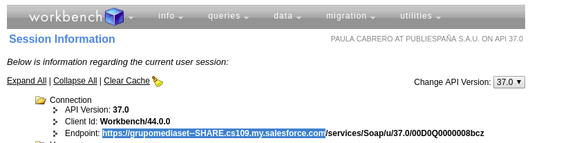

### Parametrization

El proceso será parametrizado mediante ficheros properties.

Estos han de estar alojados en un directorio hdfs o en el mismo directorio donde esté el proceso.

### Running the process

1. Ejecutar proceso en Spark

// Share
spark2-submit --master yarn --deploy-mode cluster --class es.pue.mediaset.share.Main --files file:///$output_path/mediaset-share.properties $output_path/$file --parametrization-filename "mediaset-share.properties" --process "Share"

//Inversion
spark2-submit --master yarn --deploy-mode cluster --class es.pue.mediaset.share.Main --files file:///$output_path/mediaset-share.properties $output_path/$file --parametrization-filename "mediaset-share.properties" --process "Inversion"

Parametrización: 

 * LOCAL: spark2-submit --master yarn --deploy-mode cluster --class es.pue.mediaset.share.PrepararDatos --files file:///$output_path/mediaset-share.properties $output_path/$file --parametrization-filename "mediaset-share.properties"

 * HDFS: spark2-submit --master yarn --deploy-mode cluster --class es.pue.mediaset.share.PrepararDatos --files hdfs:///$output_path/mediaset-share.properties $output_path/$file --parametrization-filename "mediaset-share.properties"

2. Observaciones:

Para la correcta realización de la conexión hay que especificar la url (en el properties salesforce.properties) que aparece a continuación.

sf.login.pre=https://grupomediaset--SHARE.cs109.my.salesforce.com #

Se ha hecho con el endpoint que consta accediendo a https://workbench.developerforce.com/sessionInfo.php

